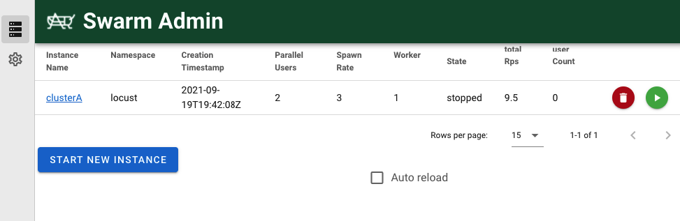
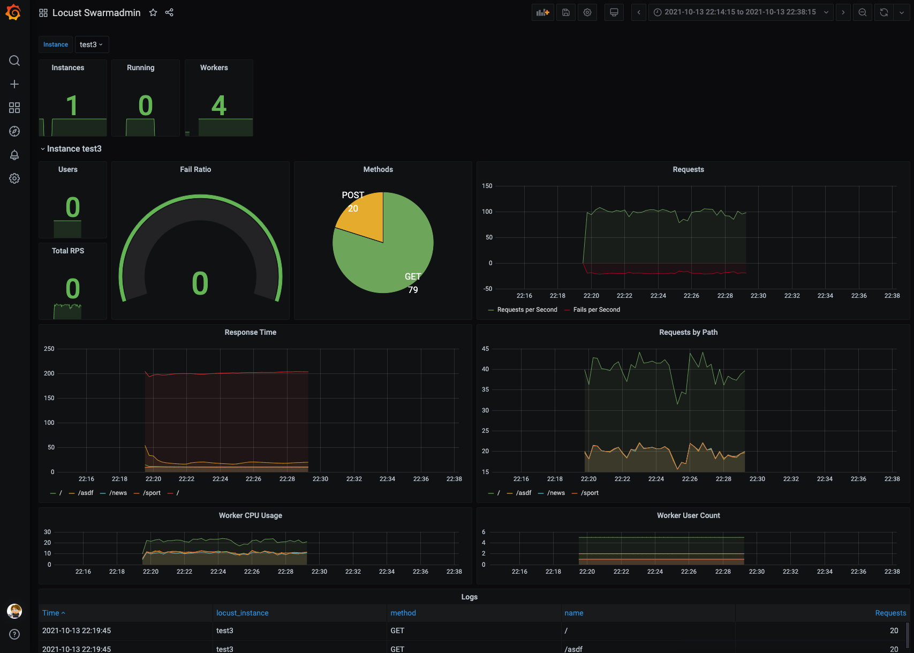

## Locust Swarmadmin
[Locust](https://www.locust.io) is an easy to use, scriptable and scalable performance testing tool. But it is not very flexible. Specially when it comes to run multiple different configured loadtests in kubernetes cloud. 

This project solves this problem by adding a additional admin interface and API to dynamically start Locust instances in your kubernetes cluster.

All configurations are stored on your kubernetes cluster. 

API Swagger documentation : https://mms-gianni.github.io/swarmadmin/swagger.html 

 
## Installation on Kubernetes
The Helm installation is based on [Deliveryhero's](https://github.com/deliveryhero/helm-charts/tree/master/stable/locust) helm charts. (Version 0.20.2)

```
cd k8s/
helm install -f values.yaml locustswarm . -n locustswarm --create-namespace
helm upgrade -f values.yaml locustswarm .
```

The results are exported and stored in Prometheus. They can easily be displayed on a grafana board


 

## Docker container environment variables
For a full list of available environment variables, please visit [.env.example](.env.example)

#### KUBECONFIG_BASE64 
A base64 encoded kubeconfig 
```
export KUBECONFIG_BASE64=$(cat kubeconfig | base64)
```
#### KUBECONFIG_PATH
Fallback if KUBECONFIG_PATH is empty

## Development 
### running a local KiND cluster
```
kind create cluster --config kind.yaml
kubectl apply -f https://raw.githubusercontent.com/kubernetes/ingress-nginx/main/deploy/static/provider/kind/deploy.yaml
kind export kubeconfig --name superlocust --kubeconfig ./kubeconfig
```
Make sure you are using the internal kubeconfig for the ENV variable to configure the helm charts
```
export KUBECONFIG_BASE64=$(kind get kubeconfig --name superlocust --internal | base64)
```

### start on local node
```
cd client && npm run build && cd .. && npm run serve
```

### build a local docker image
```
docker-compose build
``` 
(docker compose it is not usable with you KiND cluster)

## Possible future features
- [x] ~~Store loadtest results in a database (MongoDB? or Prometheus? https://github.com/siimon/prom-client) or a Prometheus exporter~~
- [ ] Add provision support for other clouds (AWS, Google, Azure, Digital Ocean ... )


